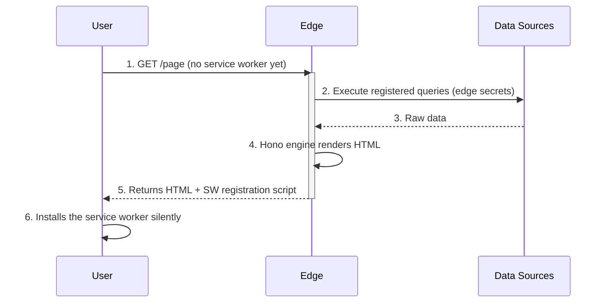
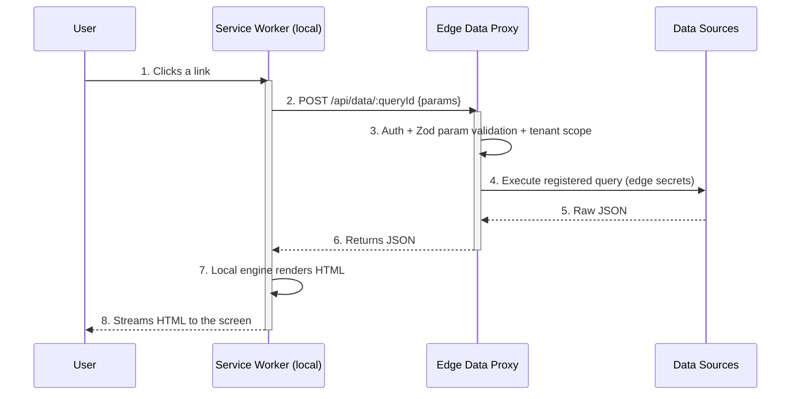
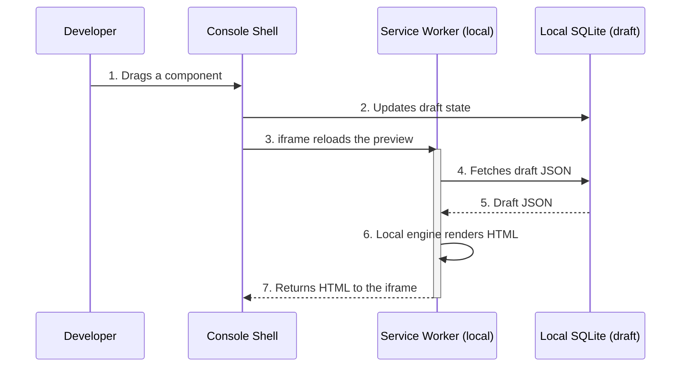

# Frontbase Architecture: Universal SSR

**Status**: Canonical rendering & deployment architecture
**Last Updated**: 2026-08-29

> This document is the **authoritative architecture specification** for the
> Frontbase framework. All other documents defer to it on rendering and
> deployment questions.

---

## 0. Guiding Principles

The framework is governed by three non-negotiable principles:

1. **Single-worker deployment**: The complete CMS — admin console, admin API,
   SSR engine, data proxy, and workflows — deploys as **one worker**
   (Cloudflare Workers primary; Node/Docker, Vercel Edge, and Deno Deploy
   supported from the same app). Zero VMs, zero standing infrastructure.
2. **Universal SSR**: One Hono-based engine renders every page. It runs in
   three environments — the cloud edge, a browser service worker, and the
   builder canvas — without changing a line of application code.
3. **One component, one implementation**: Every page component is an
   isomorphic JSX renderer that produces HTML strings. Published pages ship
   **zero React**; React is confined to the console and builder shells.

---

## 1. The Core Concept: One Engine, Three Environments

The rendering engine (Hono) is decoupled from Node.js, meaning the exact same
routing and JSX rendering code runs on a Cloudflare edge server or inside a
browser service worker.

There is no "builder framework" and "public framework". There is only **the
Engine**. The engine is injected with a different **data provider** depending
on where it wakes up.

### A. The Initial Request (SEO & FCP)
* **Environment:** Cloudflare edge worker
* **Scenario:** A visitor (or a crawler) navigates to a published page. The browser has no service worker yet.
* **Execution:** The request hits the edge. The Hono engine boots, fetches the data through its injected provider, renders the HTML, and sends it to the browser.
* **Score:** **Excellent SEO** (HTML delivered on byte one).

### B. The Handover (Progressive Enhancement)
Attached to the bottom of that initial HTML is a tiny script that registers the
**rendering service worker**. The browser silently downloads the engine in the
background. From this moment on, the engine runs inside the visitor's browser.

**Fallback-by-design:** Browsers without service worker support (or with it
disabled) simply keep hitting path A forever. Every page always works from the
edge; the service worker is an accelerator, never a requirement.

### C. Subsequent Navigations & Private Pages
* **Environment:** Browser service worker (local)
* **Scenario:** The visitor clicks a link to an auth-gated page.
* **Execution:** The service worker intercepts the request and runs the engine locally. To render, it needs data — but it must never hold database credentials. The engine's data provider makes an authenticated `fetch()` to the **Edge Data Proxy** on the edge; the proxy executes the registered query with edge-held secrets and returns JSON. The service worker renders the HTML locally.
* **Score:** **High security** (secrets never leave the edge) + **zero-latency UI** (HTML rendered locally).

### D. The Builder Canvas (Design Time)
* **Environment:** Browser service worker (local)
* **Scenario:** The author drags a component or changes a style.
* **Execution:** The service worker intercepts the preview request. The engine's data provider is wired directly to the browser's local SQLite (WASM) draft database.
* **Score:** **Instant latency** + **exact WYSIWYG fidelity** (it is literally the production engine rendering the draft data).

---

## 2. The Edge Data Proxy: Registered Queries Only

The naive version of the proxy ("service worker sends SQL, proxy runs it")
would let any browser execute arbitrary SQL with edge credentials. The
architecture therefore mandates a **registered query contract**:

* Every data binding compiles (via `@frontbase/compiler`) to a **named query**
  stored in the published site manifest: `{ queryId, parameterSchema (Zod), tenantScope }`.
* The service worker requests data by **query ID + validated parameters** — never by raw SQL:

```typescript
// Service worker side — no SQL ever crosses this boundary
fetchData: (queryId, params) =>
  fetch('/api/data/' + queryId, { method: 'POST', body: JSON.stringify(params), headers: authHeaders })
```

* The Edge Data Proxy validates the session, validates `params` against the
  query's Zod schema, applies tenant scoping, executes the pre-registered
  statement with edge secrets, and returns JSON.
* Ad-hoc SQL exists in exactly one environment: the builder canvas, against
  the **local** draft database, where there are no secrets to leak.

---

## 3. Feature Matrix

By shifting the execution context dynamically, one engine covers all constraints:

| Feature | Universal SSR | How it is Achieved |
| :--- | :--- | :--- |
| **Interaction latency** | **Instant (<1 ms)** | After the first load, the service worker intercepts navigations and renders HTML locally. |
| **WYSIWYG fidelity** | **Exact** | The builder canvas runs the same Hono engine that powers production. |
| **Code duplication** | **None** | One router, one set of JSX components. No parallel renderers. |
| **Data source security** | **High** | The service worker delegates data fetching to the Edge Data Proxy via registered query IDs. Credentials and raw SQL never reach the browser. |
| **Offline capable** | **Yes** | The service worker caches proxy JSON responses in IndexedDB; offline it renders from cache. |
| **SEO** | **Pure HTML** | The first request bypasses the service worker, so crawlers receive fully-formed SSR HTML. |
| **Deployment** | **One worker** | Engine + admin API + console assets + data proxy ship as a single deployment. |

---

## 4. The Engine: Dependency-Injected Data Providers

The Hono application code never cares where it is running. The environment
injects the data provider:

```typescript
// --- THE ENGINE (runs everywhere) ---
app.get('/dashboard', async (c) => {
  // c.env.data is injected by the environment!
  const rows = await c.env.data.query('dashboard.users.list', { limit: 50 });
  return c.html(<Dashboard data={rows} />);
});
```

### The Three Injections

1. **Cloudflare edge (initial load):**
   ```typescript
   // Executes the registered query directly with edge secrets
   data: directProvider(env.FRONTBASE_DATASOURCES)   // from @frontbase/edge-infra
   ```

2. **Service worker (published pages):**
   ```typescript
   // Delegates to the secure Edge Data Proxy — query IDs only
   data: proxyProvider('/api/data')                  // from @frontbase/edge-core (built-in)
   ```

3. **Builder canvas (service worker):**
   ```typescript
   // Reads the local WASM SQLite draft database
   data: localDraftProvider(sqliteWasm)              // from @frontbase/builder
   ```

### Rendering & Client Interactivity

* Page components are **isomorphic JSX functions** compiled by
  `@frontbase/compiler`. They render to HTML strings in all three
  environments. LiquidJS filters remain available for template variable
  resolution.
* There is **no React hydration** of published pages by default. Interactivity
  ships as a small **client behaviors runtime**: declarative `data-fb-*`
  attributes wired to event handlers (toggle, tabs, modal, form submit,
  workflow trigger). The separate `@frontbase/hydrate` package provides the
  optional client hydration runtime loaded by published pages that opt into it.
* React exists in exactly two places: the **admin console** (`@frontbase/console`)
  and the **builder shell** (`@frontbase/builder`). Page previews inside the
  canvas are iframes rendered by the engine — React never renders a published
  component.

---

## 5. Single-Worker Deployment Layout

The entire CMS is one Hono app, mounted by priority, compiled into one worker.
The deployed example (`examples/cf-full`) owns this route surface:

```typescript
// Function-owned on every host (needs state or is a redirect):
//   / and /<slug>          → published pages (SSR catch-all)
//   /sw.js                 → the browser engine bundle (service-worker handover)
//   /api/*                 → the tenant-scoped admin API, auth, Edge Data Proxy
//   /frontbase-admin (+ SPA fallbacks) → the admin console shell (the
//                            needs-setup redirect must run server-side)
//   /setup                 → first-admin setup SPA
//   /api/console/health    → liveness; /api/console/setup/* → first-run
//   other /api/console/*   → 410 Gone (retired legacy surface)
//
// Static-owned (hashed, immutable):
//   /frontbase-admin/assets/*, /static/react/* (hydration bundle), /static/icon.png
```

On Cloudflare the ASSETS binding serves the static tree; on Vercel the CDN
matrix in `vercel.json` serves it; on Deno/Docker a disk shim serves it. See
[`examples/cf-full/README.md`](../examples/cf-full/README.md) for the full
route-ownership table.

**Four hosts, one app.** Per-host entries live beside the shared app code, and
the state database is pluggable:

| Host | Statics | Default state DB |
|---|---|---|
| Cloudflare Workers | Workers Static Assets | **D1 binding** |
| Node / Docker | disk shim over staged assets | **`file:/data/app.db`** |
| Vercel Edge | CDN matrix (`vercel.json`) | **Turso** (or D1-over-REST) |
| Deno Deploy | disk shim over deployed files | **Turso** (or D1-over-REST) |

State-DB precedence on every host: `APP_DB_URL` → D1-over-REST trio → host
default. A half-configured set fails at boot naming the missing variable. The
menu is SQLite-family by construction — see
[known-limitation-postgres-mysql.md](./known-limitation-postgres-mysql.md).

**Platform services** (cache, queue, vector, storage) resolve over HTTPS from
the environment or the tenant's resource registry — the worker binds only what
its host declares. See [system-services.md](./system-services.md).

**Measured size** (`deploy:cf-full -- --dry-run`): worker **488.8 KB min+gzip**
(CF free-tier limit 1 MB); inlined `/sw.js` bundle **108.3 KB min+gzip**;
console assets are static files, outside the script budget.

### Package Mapping

| Concern | Package |
| :--- | :--- |
| Engine (unified priority router, SSR renderer, data-provider contract, workflow engine, client behaviors runtime, SW primitives) | `@frontbase/edge-core` |
| Compiling components, extracting Zod schemas/manifests, registering queries, emitting the SW bundle, CLI (`init/check/lint/simulate/deploy`) | `@frontbase/compiler` |
| Isomorphic page components (no React on published pages) | `@frontbase/ui-components` |
| Concrete data providers, Edge Data Proxy auth, cache/queue/vault, resource provisioning (server-only) | `@frontbase/edge-infra` |
| The in-worker admin API (`/api/*`) plus first-run setup and health (server-only) | `@frontbase/backend` |
| Visual canvas primitives — drag/drop model, preview↔published parity (browser-only) | `@frontbase/builder` |
| The admin console SPA — self-host build at `/frontbase-admin`, cloud build at `/admin` | `@frontbase/console` |
| Client hydration runtime for published pages | `@frontbase/hydrate` |
| The setup-only React SPA served at `/setup` | `@frontbase/admin-console` |

---

## 6. Request Lifecycles

### 1. Initial Public Request (the SEO path)



### 2. Subsequent / Private Navigation (the zero-latency path)



### 3. Builder Canvas (the design path)



---

## 7. Service Worker Lifecycle & Cache Coherence

The service worker is the riskiest moving part; these rules bound the risk:

1. **Versioned engine bundle**: every publish emits `sw.js?v=<contentHash>`.
   The registration script compares versions and calls `skipWaiting()` +
   `clients.claim()` on publish, so a stale engine survives at most one
   navigation.
2. **Manifest-driven invalidation**: the published site manifest (layouts +
   registered queries) carries a version; the service worker revalidates it on
   every navigation with a stale-while-revalidate window.
3. **Data cache**: proxied JSON responses cache in IndexedDB keyed by
   `queryId + paramsHash`, honoring per-query TTLs; offline mode serves from
   this cache with a visible staleness marker.
4. **No service worker, no problem**: crawlers, first-time visitors, Safari
   private mode, and locked-down browsers all render from the edge with full
   fidelity.

---

## 8. Key Success Factors

1. **Unify the stack (single-worker deployment)** — engine, admin API, and
   console assets ship as one zero-infrastructure unit. A developer can
   self-host the whole platform with one command.
2. **Injectable data providers** — the same engine serves the edge, the
   browser, and the canvas; every persistence surface sits behind the
   `DataProvider` contract.
3. **Invisible build tooling** — `@frontbase/compiler` compiles components,
   extracts schemas, registers queries, and emits the service-worker bundle
   automatically. Developers write plain JSX.
4. **Turnkey edge-native data** — out-of-the-box adapters for SQLite-family
   app databases (D1/Turso/libsql/file) and HTTP-reachable datasources
   (Supabase, Neon, D1) via `@frontbase/edge-infra`.

---

## Related Documents

- [PACKAGE-STRUCTURE.md](./PACKAGE-STRUCTURE.md) — package boundaries and dependency rules
- [STACK.md](./STACK.md) — technology choices in detail
- [system-services.md](./system-services.md) — cache/queue/vector/embedding runtime
- [known-limitation-postgres-mysql.md](./known-limitation-postgres-mysql.md) — the documented Postgres/MySQL app-DB limit
- [../golden-corpus/README.md](../golden-corpus/README.md) — byte-identical rendering regression corpus
