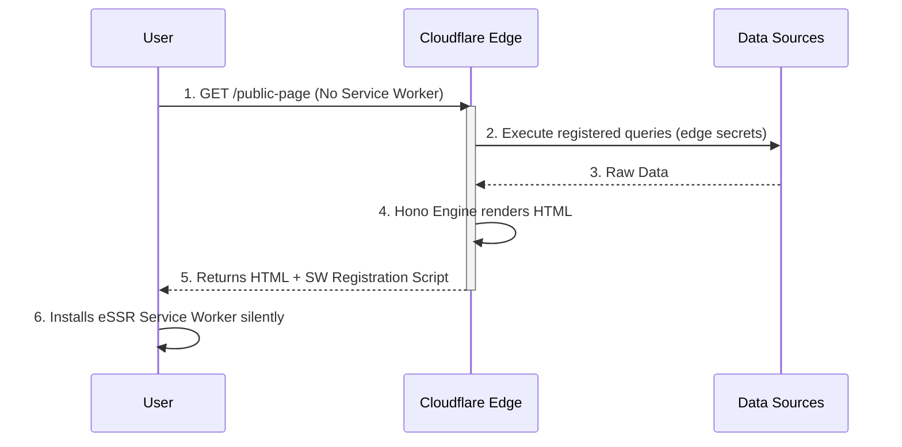
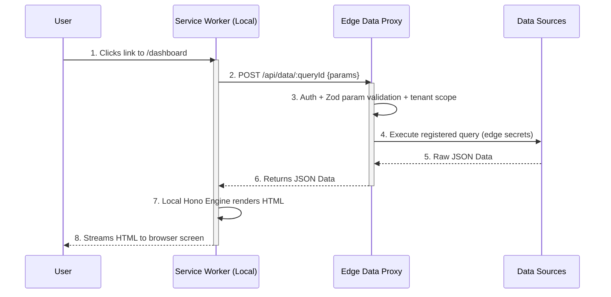
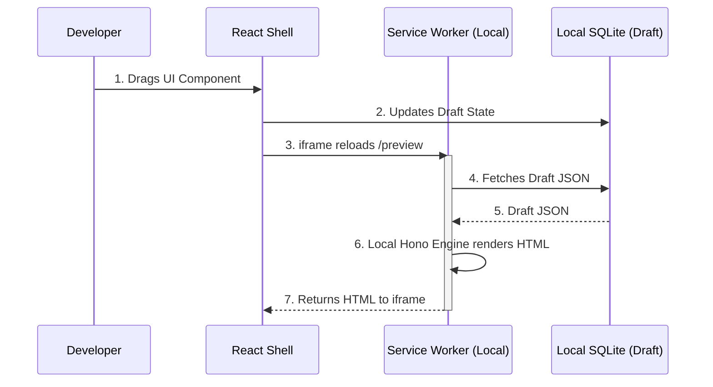

# The "Chimera" Architecture: Universal eSSR

**Version**: 2.0
**Status**: ✅ ADOPTED — Canonical rendering & deployment architecture (Decision A-12, A-13)
**Last Updated**: 2026-07-06

> This document is the **authoritative architecture specification** for the Frontbase Framework.
> All other documents in `docs/frontbase-framework/` defer to it on rendering and deployment questions.
> It supersedes the earlier "React 18 Streaming SSR" pillar from proposal v2.x.

---

## 0. Guiding Principles

The framework is governed by three non-negotiable principles:

1. **Single-Edge Deployment**: The complete CMS — builder frontend, console API, eSSR engine, data proxy, and workflows — deploys as **one edge worker** (Cloudflare Workers primary, Deno Deploy secondary). Zero VMs, zero containers, zero standing infrastructure.
2. **Universal eSSR (the Chimera model)**: One Hono-based engine renders every page. It shape-shifts across three environments — cloud edge, browser service worker, and builder canvas — without changing a line of application code.
3. **Six npm packages**: `@frontbase/edge-core`, `@frontbase/compiler`, `@frontbase/ui-components`, `@frontbase/builder`, `@frontbase/edge-infra`, `@frontbase/backend`. No more, no fewer.

---

## 1. The Core Concept: One Engine, Three Environments

Frontbase's rendering engine (Hono) is decoupled from Node.js, meaning the exact same routing and JSX rendering code can run on a Cloudflare Edge Server or inside a Browser's Service Worker.

In Universal eSSR, there is no "Builder Framework" and "Public Framework". There is only **The Engine**. The Engine is injected with different "Data Providers" depending on where it wakes up.

A crucial consequence: **there is exactly one implementation of every page component** — an isomorphic Hono/JSX renderer. The current codebase's dual implementation (React components in the builder SPA + hand-written string renderers in `services/edge/src/ssr/components/`) collapses into a single set of engine components. The existing string renderers (~1,600 lines in `static.ts` / `interactive.ts` / `data.ts`) are the **seed** of these engine components — they are architecturally closer to the Chimera than React SSR ever was.

### A. The Initial Request (SEO & FCP)
* **Environment:** Cloudflare Edge Worker
* **Scenario:** A user (or Googlebot) navigates to `frontbase.app/public-page`. The browser has no Service Worker yet.
* **Execution:** The request hits Cloudflare. The Hono Engine boots, securely reads `FRONTBASE_DATASOURCES`, fetches the data, renders the HTML, and sends it to the browser.
* **Score:** **Excellent SEO** (HTML delivered on byte one).

### B. The Handover (Progressive Enhancement)
Attached to the bottom of that initial HTML is a tiny script that registers the **eSSR Service Worker**. The browser silently downloads the Hono Engine in the background. From this moment on, the Chimera has moved inside the user's browser.

**Fallback-by-design:** Browsers without service worker support (or with it disabled) simply keep hitting path A forever. Every page always works from the edge; the service worker is an accelerator, never a requirement.

### C. Subsequent Navigations & Private/Auth Pages
* **Environment:** Browser Service Worker (Local)
* **Scenario:** The user clicks a link to an Auth-gated dashboard, or interacts with a UI element.
* **Execution:** The Service Worker intercepts the request. It runs the Hono Engine locally.
* **The Security Breakthrough:** To render the page, Hono needs data. But we cannot give the Service Worker database credentials! Instead, the Engine's Data Provider makes an authenticated `fetch()` to the **Edge Data Proxy** on Cloudflare. The proxy executes the query with edge-held secrets and returns raw JSON. The local Service Worker then renders the HTML and streams it to the screen.
* **Score:** **High Security** (Secrets never leave the edge) + **Zero Latency UI** (HTML rendered locally).

### D. The Builder Canvas (Design Time)
* **Environment:** Browser Service Worker (Local)
* **Scenario:** The developer drags a component or changes a style.
* **Execution:** The Service Worker intercepts the `/preview` request. But instead of asking Cloudflare for data, the Engine's Data Provider is wired directly to the browser's local in-memory SQLite (WASM) draft database.
* **Score:** **Instant Latency** + **100% WYSIWYG Fidelity** (It is literally the production engine rendering the draft data).

---

## 2. The Edge Data Proxy: Registered Queries Only

The naive version of the proxy ("SW sends SQL, proxy runs it") would let any browser execute arbitrary SQL with edge credentials. The Chimera therefore mandates a **registered query contract**:

* Every data binding compiles (via `@frontbase/compiler`) to a **named query** stored in the published site manifest: `{ queryId, parameterSchema (Zod), tenantScope }`.
* The Service Worker requests data by **query ID + validated parameters** — never by raw SQL:

```typescript
// Service Worker side — no SQL ever crosses this boundary
fetchData: (queryId, params) =>
  fetch('/api/data/' + queryId, { method: 'POST', body: JSON.stringify(params), headers: authHeaders })
```

* The Edge Data Proxy validates the session, validates `params` against the query's Zod schema, applies tenant scoping, executes the pre-registered statement with edge secrets, and returns JSON.
* Ad-hoc SQL exists in exactly one environment: the builder canvas, against the **local** draft database, where there are no secrets to leak.

---

## 3. Universal eSSR Feature Matrix

By shifting the execution context dynamically, the Chimera scores across all constraints:

| Feature | The "Chimera" (Universal eSSR) | How it is Achieved |
| :--- | :--- | :--- |
| **Interaction Latency** | **Instant (<1ms)** | After the first load, the Service Worker intercepts navigations and renders HTML locally. |
| **WYSIWYG Fidelity** | **High (Exact Parity)** | The Builder canvas runs the exact same Hono Engine that powers production. |
| **Code Duplication** | **None (Zero)** | One Hono router, one set of JSX components. No parallel React renderers required. |
| **Data Source Security**| **High (Edge Secrets)** | The Service Worker delegates data fetching to the Edge Data Proxy via registered query IDs. Credentials and raw SQL never reach the browser. |
| **Offline Capable** | **Excellent** | The Service Worker caches Edge JSON responses in IndexedDB. If offline, it renders HTML using cached data. |
| **SEO Effectiveness** | **Excellent (Pure HTML)** | The very first request bypassing the Service Worker ensures Web Crawlers receive pure, fully-formed SSR HTML. |
| **Deployment** | **One Worker** | Engine + console API + builder assets + data proxy ship as a single edge deployment. |

---

## 4. The Architecture of the Chimera

To make this elegant, the Hono application code cannot care where it is running. We achieve this via **Dependency Injection of the Data Provider**.

```typescript
// --- THE CHIMERA ENGINE (Runs everywhere) ---
app.get('/dashboard', async (c) => {
  // c.env.data is injected by the environment!
  const rows = await c.env.data.query('dashboard.users.list', { limit: 50 });
  return c.html(<Dashboard data={rows} />);
});
```

### The Three Injections:

1. **Cloudflare Edge (Initial Load):**
   ```typescript
   // Executes the registered query directly with edge secrets
   data: directProvider(env.FRONTBASE_DATASOURCES)   // from @frontbase/edge-infra
   ```

2. **Public/Private eSSR (Service Worker):**
   ```typescript
   // Delegates to the secure Edge Data Proxy — query IDs only
   data: proxyProvider('/api/data')                  // from @frontbase/edge-core (built-in)
   ```

3. **Builder Canvas (Service Worker):**
   ```typescript
   // Reads the local WASM SQLite draft database
   data: localDraftProvider(sqliteWasm)              // from @frontbase/builder
   ```

### Rendering & Client Interactivity

* Page components are **isomorphic Hono/JSX functions** compiled by `@frontbase/compiler`. They render to HTML strings in all three environments. LiquidJS filters remain available for template variable resolution.
* There is **no React hydration** of published pages. Interactivity ships as a small **client behaviors runtime** (~10KB): declarative `data-fb-*` attributes wired to event handlers (toggle, tabs, modal, form submit, workflow trigger). This is a formalization of the pattern the current `interactive.ts` string renderers already use.
* React exists in exactly one place: the **builder application shell** (panels, layers tree, dialogs) inside `@frontbase/builder`. Page previews inside the canvas are iframes rendered by the engine — React never renders a published component.

---

## 5. Single-Worker Deployment Layout

The entire CMS is one Hono app, mounted by priority, compiled into one worker:

```typescript
// The single deployed worker — @frontbase/edge-core unified router
const app = new Hono();

// 1. Engine bundle + builder static assets (Workers Static Assets / KV)
app.get('/sw.js', serveEngineBundle);          // the Chimera engine, compiled for SW
app.get('/assets/*', serveStatic);

// 2. Builder & console SPA shell (React, design-time only)
app.get('/app/*', spaShellRoute);

// 3. Console API — @frontbase/backend (Hono sub-router, same worker)
app.route('/api/console', consoleRouter);      // pages, drafts, publish, tenants, tokens

// 4. Edge Data Proxy — registered queries with edge secrets
app.route('/api/data', dataProxyRouter);       // from @frontbase/edge-infra

// 5. Workflows — triggers, webhooks, queue consumers
app.route('/workflows', workflowRouter);

// 6. Published pages — public eSSR catch-all
app.get('*', essrRenderHandler);
```

**Platform bindings** (all optional, adapter-selected via `@frontbase/edge-infra`):
* **Database**: Cloudflare D1, Turso/LibSQL, or Postgres via Hyperdrive
* **Cache**: Workers KV (or Redis for self-host)
* **Storage**: R2 (or Supabase Storage / Vercel Blob)
* **Queues**: Cloudflare Queues or Upstash QStash
* **Secrets**: Worker secrets + AES-GCM vault (edge-infra)

**Size budget**: the worker must fit platform limits (1 MB gzip on CF free, 10 MB paid). Targets: engine core < 70 KB min+gzip; engine + console API + data proxy < 400 KB; builder SPA assets served as static files (not counted against script size).

> **Addendum 2026-08-28 (A-24)**: the CMS now ships on FOUR hosts — Cloudflare,
> Node/Docker, Vercel Edge, Deno Deploy — from one Hono app with per-host
> entries in `examples/cf-full` and a pluggable SQLite-family state DB
> (`describeStateDb`/`resolveStateDb`: D1 binding, D1-over-REST, Turso, `file:`,
> `:memory:`). The table above describes the ADAPTER MENU of `@frontbase/edge-infra`,
> not what the deployable worker binds: the full-CMS worker binds only its host's
> surface (CF: Static Assets + D1; Vercel: none; Deno/Docker: the disk shim), and
> platform services resolve over HTTPS. "Vercel Blob" above is a storage-adapter
> reference, not a hosting target.

### Package Mapping

| Concern | Package |
| :--- | :--- |
| Engine (router, eSSR renderer, DI data-provider contract, workflows runner, Liquid filters, client behaviors runtime) | `@frontbase/edge-core` |
| Compiling components, extracting Zod schemas/manifests, registering queries, emitting the SW bundle, CLI (`init/check/lint/simulate/deploy`) | `@frontbase/compiler` |
| Isomorphic page components (engine JSX) + auth UI primitives + behavior scripts | `@frontbase/ui-components` |
| Builder React shell, local SQLite WASM draft DB, canvas↔SW preview bridge, visual workflow & sync editors | `@frontbase/builder` |
| Direct data providers, Edge Data Proxy, cache/queue/vault/storage adapters, edge auth gates, sync adapters | `@frontbase/edge-infra` |
| Console API sub-router (Hono, mounted in the same worker), Drizzle schemas & migrations | `@frontbase/backend` |

---

## 6. The Request Orchestration Lifecycles

To visualize how the Chimera shape-shifts, here are the sequence diagrams for the three distinct lifecycles of a request. Notice how the "Hono Engine renders HTML" step moves from the Cloudflare Edge to the Local Service Worker seamlessly.

### 1. Initial Public Request (The SEO Path)
*This guarantees that web crawlers and first-time visitors receive fully-formed HTML immediately.*



### 2. Subsequent / Private Navigation (The Zero-Latency Path)
*Once the Service Worker is installed, it intercepts navigations. It fetches raw data securely from the edge proxy, ensuring database credentials never reach the browser, while rendering HTML locally for zero-latency UI transitions.*



### 3. Builder Canvas (The Design Path)
*During design-time, the Engine disconnects from Cloudflare entirely. It reads the local draft database to give the developer a 100% accurate, zero-latency preview of the production code.*



---

## 7. Service Worker Lifecycle & Cache Coherence

The SW is the riskiest moving part of the Chimera; these rules bound that risk:

1. **Versioned engine bundle**: every publish emits `sw.js?v=<contentHash>`. The registration script compares versions and calls `skipWaiting()` + `clients.claim()` on publish, so stale engines survive at most one navigation.
2. **Manifest-driven invalidation**: the published site manifest (layouts + registered queries) carries a version; the SW revalidates it on every navigation with a stale-while-revalidate window.
3. **Data cache**: proxied JSON responses cache in IndexedDB keyed by `queryId + paramsHash`, honoring per-query TTLs; offline mode serves from this cache with a visible staleness marker.
4. **No SW, no problem**: crawlers, first-time visitors, Safari private mode, and enterprise-locked browsers all render from path A (edge) with full fidelity.

---

## 8. Strategic Roadmap & Key Success Factors (KSFs)

To ensure this framework achieves widespread adoption, we align around these priorities:

1. **Unify the Stack (Single Edge Worker Deployment)** — *Principle #1*
   * **Goal:** Ship the console backend as a Hono sub-router (`@frontbase/backend`) inside the same worker as the engine.
   * **Impact:** The entire application (Builder Frontend, Console API, and Edge Engine) deploys as a single, zero-infrastructure unit on Cloudflare Workers. A developer can self-host their own visual builder instantly, for free. The legacy FastAPI backend remains supported for the existing product but is **out of framework scope** (Decision A-13 supersedes A-11).

2. **Implement the Chimera Primitives (`edge-core`)** — *Principle #2*
   * **Goal:** Build the engine with dependency-injected Data Providers and Service Worker synchronization, seeded from the existing SSR string renderers.
   * **Impact:** The technical foundation for Universal eSSR (zero-latency interactions + 100% builder fidelity + zero component duplication).

3. **Invisible Build Tooling (Frictionless DX)**
   * **Goal:** `@frontbase/compiler` compiles isomorphic components, extracts schemas, registers queries, and emits the SW bundle automatically.
   * **Impact:** The developer experience remains pure JSX. The complexity of the Chimera is entirely abstracted away at build time.

4. **Turnkey Edge-Native Data & Auth**
   * **Goal:** Out-of-the-box adapters for edge databases (D1/Turso/Neon) and edge auth gates via `@frontbase/edge-infra`.
   * **Impact:** When the single worker deploys, data and auth work flawlessly without connection-pooling bottlenecks.

---

## Document Metadata

- **Version**: 2.0
- **Status**: Adopted (canonical)
- **Created**: 2026-07-05
- **Last Updated**: 2026-07-06
- **Owner**: Architecture Team
- **Related**: [DECISIONS.md](./DECISIONS.md) (A-12, A-13, A-14), [PACKAGE-STRUCTURE.md](./PACKAGE-STRUCTURE.md), [MILESTONES.md](./MILESTONES.md)
