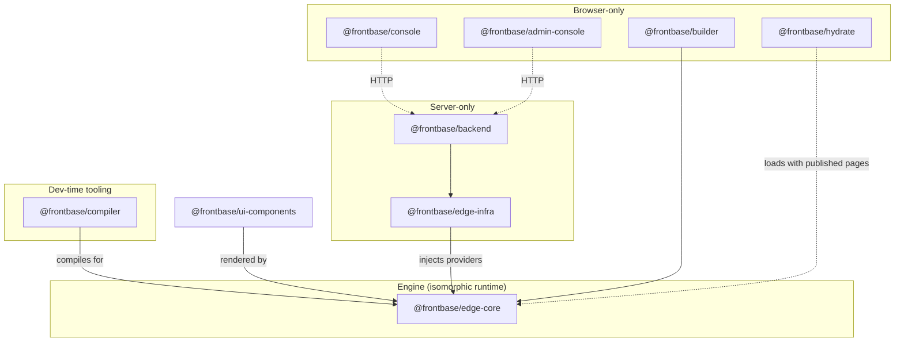

# Frontbase Package Structure

**Status**: Current — 9 packages
**Last Updated**: 2026-08-29

---

## Overview

This document defines the workspace packages and their dependency rules. Every
package role serves the three guiding principles (see
[ARCHITECTURE.md](./ARCHITECTURE.md)):

1. **Single-worker deployment** — all runtime packages compose into ONE deployable worker.
2. **Universal SSR** — one engine, one set of isomorphic components, three execution environments.
3. **Strict boundaries** — server-only packages never enter a browser bundle; browser-only packages never import server code (enforced by no-leak gates + mutation proofs).

`npx @frontbase/compiler init my-app --full` scaffolds a single-worker project
(engine + compiler + components + builder/backend wiring placeholders).

---

## Package Architecture



---

## The Packages

### 1. `@frontbase/edge-core` — the engine

The single isomorphic runtime that renders every Frontbase page in all three
environments (edge worker, browser service worker, builder canvas). Pure
runtime — zero dev tooling, zero concrete persistence.

**Includes**: unified priority-mounted Hono router; the SSR renderer
(isomorphic JSX → HTML strings with LiquidJS filter integration); the
`DataProvider` contract + built-in `proxyProvider` (registered-query fetch);
the workflow execution engine (node executors, checkpoint/rate-limit/queue
interfaces with in-memory defaults); the client behaviors runtime (declarative
`data-fb-*` interactivity — no React on published pages); service-worker
synchronization primitives (bootstrapping, versioned bundle handshake, manifest
revalidation, IndexedDB data cache); shared core types.

**Dependencies**: none

---

### 2. `@frontbase/compiler`

Dev-time compiler, schema extractor, and CLI (devDependency). Developers write
plain JSX; the compiler produces manifests, registered queries, deployable
worker artifacts, and the service-worker bundle.

**Includes**: the CLI binary (`init` with `--pure/--with-infra/--full`,
`check`/`lint` JSON diagnostics, `simulate` local boot in any provider mode,
`deploy` wrapping wrangler with D1 provisioning + secrets + setup link); the
Vite plugin; the Zod schema extractor (component `Schema` exports → manifests
for builder property panels and agent diagnostics); the query registrar
(data bindings → named registered queries); the worker composer + SW bundle
emitter; TypeScript type generation.

**Dependencies**: `@frontbase/edge-core` · **Installation**: devDependencies

---

### 3. `@frontbase/ui-components`

The single set of **isomorphic page components** (engine JSX) plus client auth
primitives. One implementation per component — rendered identically by the
engine on the edge, in the service worker, and in the builder preview.

**Includes**: basic components (Text, Heading, Image, Badge, Button, Link, …);
layout renderers (Container, Row, Column, Grid, Section — recursive
layout-tree rendering); data components (DataTable, Chart, KPICard, InfoList,
Forms) bound to registered queries; landing components (Hero, Features,
Pricing, Testimonials, FAQ, CTA); per-component behavior scripts; auth
primitives (login/signup/reset flows, session helpers, protected-route gates).

**Explicitly NOT here**: React console/builder chrome — that lives in
`@frontbase/console` and `@frontbase/builder`.

**Dependencies**: `@frontbase/edge-core`

---

### 4. `@frontbase/edge-infra` (server-only)

Concrete infrastructure adapters injected into the engine — everything that
touches secrets, persistence, or third-party systems.

**Includes**: direct data providers (SQLite, Cloudflare D1, Turso/libsql,
Supabase Postgres, Neon Postgres) implementing the `DataProvider` contract;
Edge Data Proxy auth; cache/queue/vector adapters (Upstash REST, QStash,
BullMQ/ioredis on Node, libsql vector, Cloudflare Vectorize); AES-GCM secrets
vault; R2/S3-compatible blob storage; Cloudflare + Supabase resource
provisioning.

**Dependencies**: `@frontbase/edge-core`

---

### 5. `@frontbase/backend` (server-only)

The CMS backend inside the same worker as the engine
([Principle 1](./ARCHITECTURE.md)). It serves the tenant-scoped `/api/*`
admin API consumed by the console, plus the retained first-run setup and
health routes. There is no separate backend deployment.

**Includes**: the admin API (tenant-scoped pages, auth, storage, workflows,
datasources, edge resources, plans, tenants, administration operations);
default-deny auth middleware; Drizzle schemas & migrations (the single source
of truth for CMS persistence, executed against the edge-infra database
adapters); the publish pipeline (layout validation → manifest versioning →
cache invalidation).

**Dependencies**: `@frontbase/edge-infra`

---

### 6. `@frontbase/builder` (browser-only)

The visual canvas primitives — the drag/drop model, the local SQLite WASM
draft database, and the `localDraftProvider` implementation. WYSIWYG fidelity
is exact because the canvas preview is the production engine.

**Dependencies**: `@frontbase/edge-core`, `@frontbase/ui-components` ·
**Size note**: served as static assets from the worker — never counted against
the worker script size limit.

---

### 7. `@frontbase/console` (browser-only)

The admin console SPA, built from this repo's source. Two builds from one
package: the self-host build staged at `/frontbase-admin` and the cloud build
staged at `/admin`. Talks to the backend over HTTP only.

**Dependencies**: React, TanStack Query, React Flow (editor chrome) — never
imports server-only packages.

---

### 8. `@frontbase/hydrate` (browser-only)

The client hydration runtime for published pages — the `/static/react/*`
bundle loaded by pages that opt into client-side hydration.

**Dependencies**: React — never imports server-only packages.

---

### 9. `@frontbase/admin-console` (browser-only)

The setup-only React SPA served at `/setup` for first-admin bootstrap. Carries
no dashboard routes and no server code.

**Dependencies**: React

---

## CLI Bootstrapping Flags

```bash
# Pattern A: pure framework (code-first)
npx @frontbase/compiler init my-app --pure
# Scaffolds: edge-core, compiler, ui-components (in-memory providers)

# Pattern B: full CMS (single-worker project)
npx @frontbase/compiler init my-app --full
# --pure + builder/backend wiring placeholders

# Pattern C: selective
npx @frontbase/compiler init my-app --with-infra
# --pure + edge-infra wiring placeholders (durable workflows, data proxy, vault)

# Compose + provision + deploy the worker (Cloudflare: D1, secrets, setup link)
npx @frontbase/compiler deploy
```

---

## Success Criteria

- [x] Every page component has exactly **one** implementation, rendered
      byte-identically on the edge, in the service worker, and in the builder
      preview (enforced by the [golden corpus](../golden-corpus/README.md)).
- [x] The full CMS deploys as **one** worker within platform script limits
      (measured 488.8 KB min+gzip vs the 1 MB Cloudflare free-tier ceiling).
- [x] The Edge Data Proxy rejects any request that is not a registered query
      with valid params.
- [x] Every server/browser boundary has a no-leak gate with a mutation proof.
- [ ] Scaffolding flags produce working projects for all three patterns.

---

## Related Documents

- [ARCHITECTURE.md](./ARCHITECTURE.md) — canonical architecture
- [STACK.md](./STACK.md) — technology choices in detail
