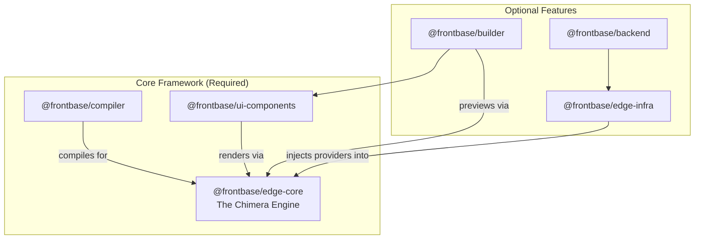

# Frontbase Framework: Consolidated Package Structure (Chimera)

**Version**: 2.0
**Status**: Approved — 6 packages under the Chimera (Universal eSSR) architecture
**Last Updated**: 2026-07-06

---

## Overview

This document defines the complete package structure for the Frontbase modular framework under the **Chimera architecture** ([CHIMERA-ARCHITECTURE.md](./CHIMERA-ARCHITECTURE.md)). The original 35-package proposal was consolidated to **6 packages** (Decisions A-3…A-10, A-14), and every package role is now defined by the three guiding principles:

1. **Single-edge deployment** — all runtime packages compose into ONE deployable worker.
2. **Universal eSSR** — one engine, one set of isomorphic components, three execution environments.
3. **Six npm packages** — fixed surface; new capabilities extend existing packages rather than adding new ones.

`npx @frontbase/compiler init my-app --full` scaffolds **100% of the self-hosted Frontbase CMS** as a single-worker project.

---

## Package Architecture



---

## Core Packages (Required)

### 1. `@frontbase/edge-core` — The Chimera Engine

**Description**: The single isomorphic runtime that renders every Frontbase page in all three environments (cloud edge worker, browser service worker, builder canvas). Pure runtime — zero dev tooling, zero concrete persistence.

**Includes**:
- **Unified Hono Router**: priority-mounted single-worker routing (assets → SPA shell → console API → data proxy → workflows → eSSR catch-all) with adapters for Cloudflare Workers and Deno Deploy.
- **eSSR Renderer**: isomorphic JSX → HTML string rendering with LiquidJS filter integration. Seeded from the existing `services/edge/src/ssr/` string renderers.
- **Data Provider Contract (DI)**: `DataProvider` interface + built-in `proxyProvider` (registered-query fetch). Concrete `directProvider`/`localDraftProvider` implementations live in edge-infra/builder.
- **Workflow Execution Engine**: stateless runner, node executors, checkpoint/rate-limit/queue **interfaces** with in-memory defaults; durable adapters injected from `@frontbase/edge-infra`.
- **Client Behaviors Runtime** (~10 KB): declarative `data-fb-*` interactivity for published pages (toggle, tabs, modal, forms, workflow triggers). No React on published pages.
- **SW Synchronization Primitives**: engine bootstrapping inside a service worker, versioned bundle handshake, manifest revalidation, IndexedDB data cache.
- **Core Types**: shared TypeScript interfaces (`packages/types/` merges here).

**Dependencies**: None
**Bundle Size Target**: **< 70 KB min+gzip** (enforced in CI)

---

### 2. `@frontbase/compiler`

**Description**: Dev-time compiler, schema extractor, and CLI (devDependency). Makes the Chimera invisible: developers write plain JSX; the compiler produces engine components, manifests, registered queries, and the service-worker bundle.

**Includes**:
- **CLI Binary** (`bin/frontbase.js`): `init` (scaffold with `--pure/--with-infra/--full`), `check`/`lint` (JSON diagnostics for agents), `simulate` (boot the engine locally in any of the three provider modes), `deploy` (single-worker deployment wrapping wrangler/deployctl).
- **Vite Plugin**: AST transformation compiling TSX components into engine-renderable components + behavior scripts.
- **Zod Schema Extractor**: scans components for `Schema` exports; generates manifests for builder property panels and agent diagnostics.
- **Query Registrar**: compiles data bindings into named registered queries (`queryId` + Zod param schema + tenant scope) consumed by the Edge Data Proxy.
- **SW Bundle Emitter**: packages the engine + site manifest into the versioned `sw.js` artifact.
- **TypeScript Type Generator**: schema → type declarations.

**Dependencies**: `@frontbase/edge-core`
**Installation**: `devDependencies`

---

### 3. `@frontbase/ui-components`

**Description**: The single set of **isomorphic page components** (engine JSX) plus client auth primitives. One implementation per component — rendered identically by the engine on the edge, in the service worker, and in the builder preview.

**Includes**:
- **Basic Components**: Text, Heading, Image, Badge, Divider, Icon, Button, Link, etc. (engine JSX; consolidates the current `static.ts`/`interactive.ts` renderers).
- **Layout Renderers**: Container, Row, Column, Grid, Section — recursive layout-tree rendering.
- **Data Components**: DataTable, Chart, KPICard, InfoList, Forms — bound to registered queries via the data-provider contract (consolidates the current `data.ts` + `packages/{datatable,chart,form,grid,infolist,kpicard}`).
- **Landing Components**: Hero, Features, Pricing, Testimonials, FAQ, CTA.
- **Behavior Scripts**: per-component client interactivity registered with the behaviors runtime.
- **Auth Primitives**: login/signup/reset flows, session helpers, and protected-route gates rendered by the engine; client SDK adapters (Supabase Auth, Clerk, SuperTokens).

**Explicitly NOT here**: React components. The builder's own React UI chrome lives in `@frontbase/builder`.

**Dependencies**: `@frontbase/edge-core`

---

## Optional Feature Packages

### 4. `@frontbase/builder`

**Description**: The visual design workspace — a React application shell whose preview pane is the production engine running in a local service worker against a local draft database. WYSIWYG fidelity is exact because there is no second renderer.

**Includes**:
- **Builder Canvas Shell** (React): layers tree, drag-and-drop controls, responsive grid tools, template catalog.
- **Local Draft Database**: SQLite WASM in-browser store for layouts, workflow drafts, and sync mappings; `localDraftProvider` implementation for the engine.
- **Canvas ↔ SW Preview Bridge**: iframe `/preview` rendering through the local engine (CHIMERA §6.3).
- **Visual Workflow Editor**: React-Flow canvas for workflow sequences.
- **Sync Configuration Dashboard**: column-mapping canvas, conflict settings, job logs.
- **Properties Inspectors**: dynamic forms generated from component/workflow/sync Zod manifests.

**Dependencies**: `@frontbase/edge-core`, `@frontbase/ui-components`
**Size note**: served as static assets from the worker — does not count against the worker script size limit.

---

### 5. `@frontbase/edge-infra`

**Description**: Concrete infrastructure adapters injected into the engine — everything that touches secrets, persistence, or third-party systems. Edge-native first.

**Includes**:
- **Direct Data Providers**: Cloudflare D1, Turso/LibSQL, PostgreSQL (Hyperdrive), SQLite — implementing the engine's `DataProvider` contract with edge-held secrets.
- **Edge Data Proxy**: the `/api/data/:queryId` Hono sub-router — session validation, Zod param validation, tenant scoping, registered-query execution (CHIMERA §2).
- **Edge Caching**: Workers KV, Deno KV, Redis (self-host).
- **Background Queues**: Cloudflare Queues, Upstash QStash, BullMQ (self-host) — implementing the engine's workflow durability interfaces.
- **Security Vault**: AES-GCM secrets encryption, key rotation, versioning, audits.
- **Edge Auth Gates**: JWT validation, token parsing, Hono session middlewares.
- **Data Sync Engine & Adapters**: cron sync engine + source adapters (MySQL, PostgreSQL, Neon, Supabase, Google Sheets, WordPress, REST).
- **Blob Storage**: Cloudflare R2, Supabase Storage, Vercel Blob.

**Dependencies**: `@frontbase/edge-core`

---

### 6. `@frontbase/backend`

**Description**: The CMS console API — a **TypeScript/Hono sub-router mounted at `/api/console` inside the same worker** as the engine (Principle #1). There is no separate backend deployment.

**Includes**:
- **Console Sub-Router**: pages & drafts CRUD, publish pipeline (manifest + registered-query emission), project/tenant management, tokens, user administration.
- **Drizzle Schemas & Migrations**: the single source of truth for CMS persistence, executed against the edge-infra database adapters.
- **Publish Pipeline**: layout validation → manifest versioning → SW bundle version bump → cache invalidation.

**Explicitly NOT here** (Decision A-13, supersedes A-11): the Python/FastAPI backend. It remains the legacy self-hosted product's runtime and migration source, but it is **not an npm package and not part of the framework deploy**.

**Dependencies**: `@frontbase/edge-infra`

---

## CLI Bootstrapping Flags

```bash
# Pattern A: Pure Framework (code-first)
npx @frontbase/compiler init my-app --pure
# Scaffolds: edge-core, compiler, ui-components
# eSSR + programmatic workflows fully functional (in-memory providers)

# Pattern B: Full CMS (single-worker self-hosted stack)
npx @frontbase/compiler init my-app --full
# Scaffolds: all 6 packages → ONE deployable edge worker

# Pattern C: Selective
npx @frontbase/compiler init my-app --with-infra
# Scaffolds: core + edge-infra (durable workflows, data proxy, vault, auth gates)

# Deploy the whole CMS
npx @frontbase/compiler deploy
```

---

## Success Criteria

- [ ] `@frontbase/edge-core` production bundle < 70 KB min+gzip (CI-gated).
- [ ] The full CMS deploys as **one** worker within platform script limits (≤ 1 MB gzip target).
- [ ] Every page component has exactly **one** implementation, rendered byte-identically on edge, in SW, and in builder preview.
- [ ] The Edge Data Proxy rejects any request that is not a registered query with valid params.
- [ ] Programmatic workflows execute without builder or infra packages (in-memory mode).
- [ ] Scaffolding flags produce working projects for all three patterns.

---

## Document Metadata

- **Version**: 2.0
- **Status**: Approved (Chimera)
- **Created**: 2026-06-30
- **Last Updated**: 2026-07-06
- **Owner**: Architecture Team
- **Related Documents**:
  - [CHIMERA-ARCHITECTURE.md](./CHIMERA-ARCHITECTURE.md) — Canonical architecture
  - [DECISIONS.md](./DECISIONS.md) — A-12, A-13, A-14
  - [ARCHITECTURE-SPLIT.md](./ARCHITECTURE-SPLIT.md) — Modular split details
  - [MILESTONES.md](./MILESTONES.md) — Roadmap
